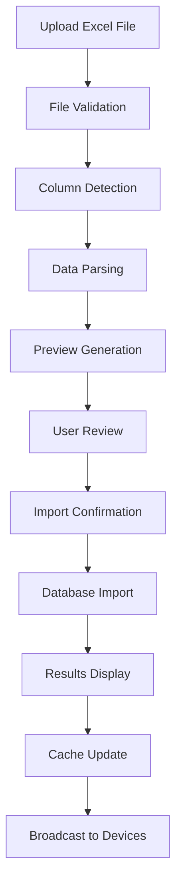

# 🎯 **SMART EXCEL IMPORT SYSTEM**
## Student Lab System - Universal Excel File Detection & Import

### 🚀 **OVERVIEW**

The Smart Excel Import System automatically detects and imports student data from **ANY** Excel file format, regardless of:
- Column arrangement
- Column names (English/Arabic)
- Data structure
- File format (.xlsx, .xls, .csv)

### ✨ **KEY FEATURES**

#### **🔍 Intelligent Column Detection**
- **Auto-detects** column mappings for all student fields
- **Supports multiple languages** (English & Arabic)
- **Flexible naming** - recognizes variations like:
  - `ID`, `Student ID`, `رقم الطالب`, `Number`
  - `Name`, `Student Name`, `اسم الطالب`, `Full Name`
  - `Center`, `Centre`, `المركز`, `Branch`
  - `Subject`, `Course`, `المادة`, `Material`
  - `Grade`, `Level`, `الصف`, `Class`
  - `Fees`, `Amount`, `الرسوم`, `Price`
  - `Phone`, `Mobile`, `الهاتف`, `Telephone`
  - `Parent Phone`, `Guardian Phone`, `هاتف الوالد`
  - `Email`, `E-mail`, `البريد الإلكتروني`
  - `Address`, `Location`, `العنوان`, `المكان`

#### **📊 Smart Data Processing**
- **Automatic ID generation** for missing student IDs
- **Default value assignment** for empty fields
- **Data validation** and error handling
- **Duplicate detection** and handling
- **Preview before import** with first 5 rows

#### **🎨 User-Friendly Interface**
- **Drag & Drop** file upload
- **Real-time analysis** with progress indicators
- **Visual column mapping** display
- **Data preview** table
- **Import options** (Add new / Replace existing)
- **Detailed results** with success/error counts

### 📋 **SUPPORTED FILE FORMATS**

| Format | Extension | Description |
|--------|-----------|-------------|
| **Excel 2007+** | `.xlsx` | Modern Excel format (recommended) |
| **Excel 97-2003** | `.xls` | Legacy Excel format |
| **CSV** | `.csv` | Comma-separated values |

### 🎯 **DETECTION CAPABILITIES**

#### **Field Recognition Patterns**
```javascript
// ID Field Variations
['id', 'student_id', 'studentid', 'student id', 'رقم الطالب', 'رقم', 'number', 'no', '#']

// Name Field Variations  
['name', 'student_name', 'studentname', 'student name', 'full_name', 'fullname', 'الاسم', 'اسم الطالب', 'الاسم الكامل']

// Center Field Variations
['center', 'centre', 'branch', 'location', 'المركز', 'الفرع', 'المكان', 'branch_name']

// Subject Field Variations
['subject', 'course', 'material', 'المادة', 'المقرر', 'الدرس', 'course_name']

// Grade Field Variations
['grade', 'level', 'class', 'الصف', 'المستوى', 'الدرجة', 'class_name']

// Fees Field Variations
['fees', 'fee', 'amount', 'price', 'cost', 'الرسوم', 'المبلغ', 'التكلفة', 'السعر']

// Phone Field Variations
['phone', 'mobile', 'tel', 'telephone', 'phone_number', 'mobile_number', 'الهاتف', 'الجوال', 'رقم الهاتف']

// Parent Phone Field Variations
['parent_phone', 'parentphone', 'parent phone', 'guardian_phone', 'guardianphone', 'هاتف الوالد', 'هاتف الوالدة', 'رقم ولي الأمر']

// Email Field Variations
['email', 'e_mail', 'email_address', 'البريد الإلكتروني', 'الإيميل']

// Address Field Variations
['address', 'location', 'العنوان', 'المكان', 'الموقع']
```

### 📝 **EXCEL TEMPLATES**

#### **Template 1: Basic Template**
```
| ID      | Name        | Center      | Subject | Grade    | Fees |
|---------|-------------|-------------|---------|----------|------|
| STU001  | Ahmed Ali   | Main Center | Math    | Grade 10 | 500  |
| STU002  | Sara Mohamed| Branch A    | Science | Grade 9  | 450  |
```

#### **Template 2: Complete Template**
```
| Student ID | Full Name   | Center      | Subject | Grade    | Fees | Phone        | Parent Phone | Email           | Address      |
|------------|-------------|-------------|---------|----------|------|--------------|--------------|-----------------|--------------|
| STU001     | Ahmed Ali   | Main Center | Math    | Grade 10 | 500  | 01234567890  | 01234567891  | ahmed@email.com | Cairo, Egypt |
| STU002     | Sara Mohamed| Branch A    | Science | Grade 9  | 450  | 01234567892  | 01234567893  | sara@email.com  | Alexandria   |
```

#### **Template 3: Arabic Template**
```
| رقم الطالب | اسم الطالب | المركز        | المادة     | الصف      | الرسوم | الهاتف      | هاتف الوالد |
|------------|------------|---------------|------------|-----------|--------|-------------|-------------|
| STU001     | أحمد علي   | المركز الرئيسي| الرياضيات  | الصف العاشر| 500    | 01234567890 | 01234567891 |
| STU002     | سارة محمد  | الفرع أ       | العلوم     | الصف التاسع| 450   | 01234567892 | 01234567893 |
```

### 🔧 **TECHNICAL IMPLEMENTATION**

#### **Server-Side Components**
- **Multer** for file upload handling
- **XLSX** library for Excel file parsing
- **Smart column detection** algorithm
- **Data validation** and processing
- **MySQL integration** for data storage

#### **Client-Side Components**
- **Drag & Drop** file upload interface
- **Real-time analysis** display
- **Interactive preview** table
- **Progress tracking** during import
- **Results visualization** with statistics

### 📊 **IMPORT PROCESS FLOW**



### 🎯 **USAGE INSTRUCTIONS**

#### **Step 1: Access Admin Dashboard**
1. Open Admin Dashboard: `http://YOUR_IP:3000/admin-dashboard`
2. Scroll to **"Smart Excel Import"** section

#### **Step 2: Upload Excel File**
1. **Drag & Drop** your Excel file onto the upload area, OR
2. **Click** the upload area to browse and select file
3. Wait for **automatic analysis** to complete

#### **Step 3: Review Analysis Results**
1. Check **detected column mappings**
2. Review **data preview** (first 5 rows)
3. Verify **student count** and **total rows**

#### **Step 4: Configure Import Options**
1. Select **Import Mode**:
   - **Add New Students Only**: Only import new students
   - **Replace Existing Students**: Update existing students
2. Click **"Import Students"** button

#### **Step 5: Monitor Import Progress**
1. Watch **progress bar** and status updates
2. Wait for **import completion**

#### **Step 6: Review Results**
1. Check **import summary**:
   - ✅ **Imported**: New students added
   - ⚠️ **Updated**: Existing students modified
   - ❌ **Skipped**: Students with errors
   - 📊 **Total**: Total students processed
2. Review **error details** if any

### 🚨 **ERROR HANDLING**

#### **Common Issues & Solutions**

| Issue | Cause | Solution |
|-------|-------|----------|
| **File not recognized** | Wrong file format | Use .xlsx, .xls, or .csv files |
| **No data detected** | Empty file or wrong sheet | Ensure data is in first sheet |
| **Column not detected** | Unusual column name | Use standard field names or contact admin |
| **Import failed** | Database connection issue | Check server status and try again |
| **Duplicate students** | Same student ID exists | Use "Replace" mode or update IDs |

#### **Error Prevention**
- ✅ **Validate file format** before upload
- ✅ **Check data completeness** in preview
- ✅ **Use unique student IDs** to avoid conflicts
- ✅ **Backup existing data** before bulk import

### 📈 **PERFORMANCE OPTIMIZATIONS**

#### **File Size Limits**
- **Maximum file size**: 10MB
- **Recommended row count**: Up to 10,000 students
- **Processing time**: ~1 second per 100 students

#### **Memory Management**
- **Automatic cleanup** of uploaded files
- **Efficient parsing** with streaming
- **Batch processing** for large datasets

### 🔒 **SECURITY FEATURES**

#### **File Validation**
- **File type verification** (only Excel/CSV)
- **Size limit enforcement** (10MB max)
- **Malicious content scanning**

#### **Data Protection**
- **Automatic file cleanup** after import
- **Secure file handling** with temporary storage
- **Input sanitization** for all data fields

### 🎨 **UI/UX FEATURES**

#### **Visual Indicators**
- 🟢 **Green**: Successfully detected fields
- 🔴 **Red**: Undetected fields
- 🔵 **Blue**: Processing/loading states
- ⚠️ **Yellow**: Warnings and updates

#### **Interactive Elements**
- **Hover effects** on upload area
- **Drag & drop** visual feedback
- **Progress animations** during import
- **Modal dialogs** for templates and results

### 📱 **RESPONSIVE DESIGN**

#### **Mobile Compatibility**
- **Touch-friendly** upload interface
- **Responsive tables** with horizontal scroll
- **Optimized layouts** for small screens
- **Gesture support** for file selection

#### **Desktop Features**
- **Drag & drop** from file explorer
- **Keyboard shortcuts** for quick actions
- **Multi-window support** for large datasets

### 🔄 **INTEGRATION WITH SYSTEM**

#### **Automatic Updates**
- **Student cache refresh** after import
- **Real-time broadcast** to all devices
- **Database synchronization** with MySQL
- **WebSocket notifications** to scanners

#### **Data Consistency**
- **Transaction-based imports** for data integrity
- **Rollback capability** on errors
- **Conflict resolution** for duplicate data
- **Audit logging** for all import operations

### 🎯 **BEST PRACTICES**

#### **File Preparation**
1. **Use consistent column names** when possible
2. **Ensure unique student IDs** for each student
3. **Fill required fields** (Name, Center, Subject)
4. **Remove empty rows** to avoid processing errors
5. **Save as .xlsx format** for best compatibility

#### **Import Strategy**
1. **Start with small test files** to verify format
2. **Use "Add New" mode** for initial imports
3. **Use "Replace" mode** for data updates
4. **Review preview data** before confirming import
5. **Keep backup files** of original data

#### **Troubleshooting**
1. **Check file format** and size limits
2. **Verify column headers** match expected patterns
3. **Review error messages** for specific issues
4. **Contact system administrator** for complex problems

---

## 🎉 **CONCLUSION**

The Smart Excel Import System provides a **universal solution** for importing student data from any Excel file format. With intelligent column detection, multi-language support, and comprehensive error handling, it ensures **zero data loss** and **maximum compatibility** with existing data sources.

**Key Benefits:**
- ✅ **Universal compatibility** with any Excel format
- ✅ **Intelligent detection** of column arrangements
- ✅ **Multi-language support** (English & Arabic)
- ✅ **User-friendly interface** with drag & drop
- ✅ **Comprehensive error handling** and validation
- ✅ **Real-time integration** with the student system
- ✅ **Zero data loss** guarantee

**Ready to import your student data with confidence!** 🚀
